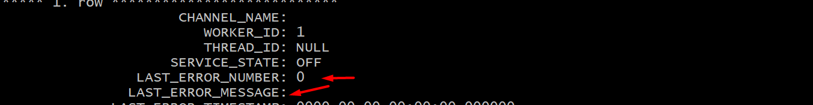

### mysql replication using ```gtid```
    1. Set master server configs to mysqld.cnf and restart mysql:
***
    sudo nano /etc/mysql/mysql.conf.d/mysqld.cnf
***
    gtid_mode                = ON 
***
    enforce_gtid_consistency = ON
set to

    bind-address = 0.0.0.0
***
    server-id              = 1
***
    binlog-format           = ROW
***
    replicate-do-db         = db_name

#### save configs
#### restart mysql
    sudo systemctl restart mysql

#### allow slave server to port 3306
    sudo ufw allow from slave_ip to any port 3306

`2. create user and grant replicarion:`

    CREATE USER 'sammy'@'slave_ip' IDENTIFIED BY 'password';
***
    grant replication slave, replication client, reload, select on *.* to 'user'@'slave_ip';
***
    FLUSH PRIVILEGES;

    3. Set slave server configs to mysqld.cnf and restart mysql:
***
    sudo nano /etc/mysql/mysql.conf.d/mysqld.cnf
***
    bind-address            = 0.0.0.0
***
    server-id               = 2
***
    gtid_mode               = ON
***
    enforce-gtid-consistency = ON
***
    log_bin                 = ON
***
    binlog_format           = ROW
***
    replicate-do-db         = db_name

#### save configs
#### restart mysql
    sudo systemctl restart mysql

`4. dump database from master and import to slave server:`

    mysqldump -u root -p --databases database_name --single-transaction --triggers --routines --events --set-gtid-purged=ON > /path/database_name_dump.sql
***
    scp /path/database_name_dump.sql user@slave_ip:/new_path/database_name_dump.sql

#### create new database in slave server:
    create database db_name;

#### import dump:

    mysql -u root -p crm_reports_test_db < database_name_dump.sql

`5. reset master`
***
    reset master
***
    CHANGE MASTER TO MASTER_HOST='master_ip', MASTER_PORT=3306, MASTER_USER='user_name', MASTER_PASSWORD='password',MASTER_AUTO_POSITION=1;
    
`6. start slave and check status;`   

run to mysql `start slave;`

    show slave status\G
#### it should be like this


    SELECT * FROM performance_schema.replication_applier_status_by_worker\G
and check 

this params

